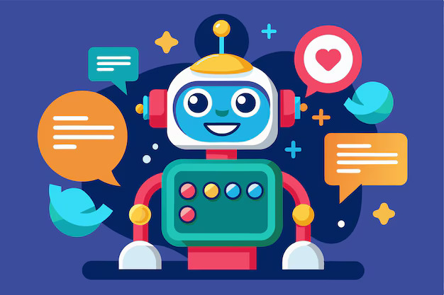

# 🏥 Medical Chatbot — AI-Powered Medical Q&A with Retrieval-Augmented Search

An AI chatbot that answers medical questions by retrieving relevant information from a knowledge base rather than relying purely on a language model's memory — reducing hallucinated or made-up answers on sensitive topics.



---

## The Problem This Solves

General-purpose chatbots can confidently produce incorrect medical information because they generate answers from what a language model "remembers," with no way to verify it against a real source. This project takes a **retrieval-augmented generation (RAG)** approach instead: medical reference material is embedded into a vector database, and every user query is answered using content actually retrieved from that knowledge base — grounding responses in real source material rather than the model's raw output.

This is the same underlying pattern used in enterprise AI tools that need to answer questions from a company's internal documents, policies, or knowledge base — just applied here to the medical domain.

---

## How It Works

```
Medical reference documents
        ↓
   Text chunking
        ↓
  Embedding generation
        ↓
  Pinecone vector index  ← (built by store_index.py)
        ↓
  User query → semantic search → relevant chunks retrieved
        ↓
  LLM generates an answer grounded in retrieved context
        ↓
  Response shown in the chat UI
```

**Pipeline stages:**
1. **Ingestion** (`research/`, `store_index.py`) — source medical reference material is processed and embedded, then stored in a Pinecone vector index for semantic search
2. **Retrieval** (`src/`) — incoming user questions are embedded and matched against the vector index to pull the most relevant chunks
3. **Generation** (`app.py`) — retrieved context is passed to the language model, which generates a response grounded in that material
4. **Interface** (`templates/`, `static/`) — a lightweight Flask web UI for chatting with the assistant

---

## Tech Stack

- **Backend:** Python, Flask
- **AI/ML:** OpenAI (generation), Pinecone (vector search / semantic retrieval)
- **Frontend:** HTML, CSS, JS
- **Architecture pattern:** Retrieval-Augmented Generation (RAG)

---

## Setup & Installation

```bash
# 1. Clone the repository
git clone https://github.com/Aymen016/Medical-Chatbot.git
cd Medical-Chatbot

# 2. Create a virtual environment
python -m venv venv
source venv/bin/activate      # macOS/Linux
venv\Scripts\activate         # Windows

# 3. Install dependencies
pip install -r requirements.txt

# 4. Add your API keys
# Create a .env file with your OpenAI and Pinecone credentials

# 5. Build the vector index (run once, or whenever source docs change)
python store_index.py

# 6. Run the app
python app.py
```

---

## Project Structure

```
├── research/          # Source medical reference material
├── src/                # Retrieval + chatbot logic
├── static/             # CSS/JS frontend assets
├── templates/          # HTML templates
├── app.py              # Main Flask app
├── store_index.py      # Builds the Pinecone vector index from source docs
├── template.py          # UI template logic
└── requirements.txt
```

---

## Features

- Semantic search over medical reference content using Pinecone
- Retrieval-augmented responses instead of unconstrained model output
- Clean, simple chat interface
- Modular pipeline — ingestion, retrieval, and generation are separated, making it straightforward to swap in a different document set, vector store, or model

---

## Possible Extensions

- Add source citations so every answer links back to the specific reference passage used
- Add an evaluation set to measure retrieval accuracy on known questions
- Add a confidence threshold so the bot declines to answer when retrieval quality is low

---

## License

MIT

## Contact

📧 ayemenbaig26@gmail.com · [LinkedIn](https://www.linkedin.com/in/aymen016)
